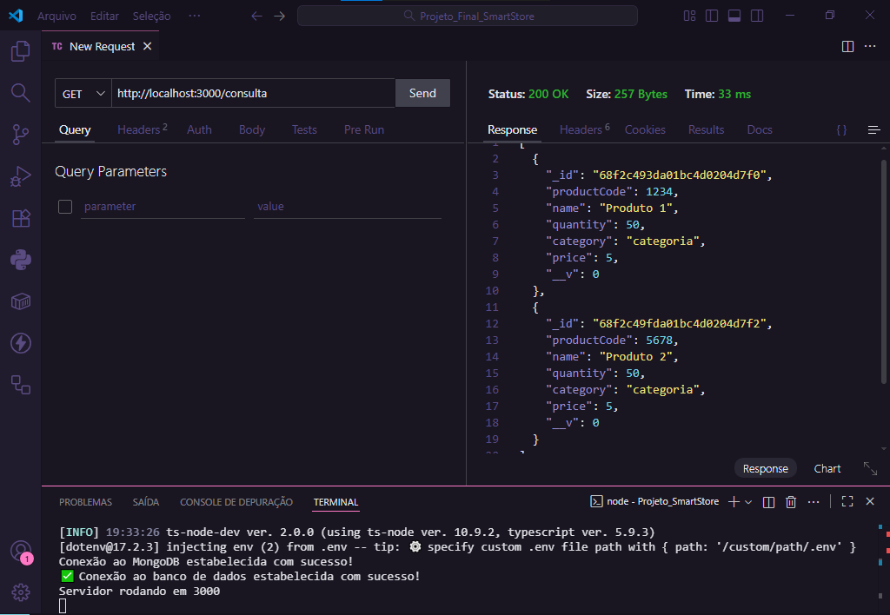
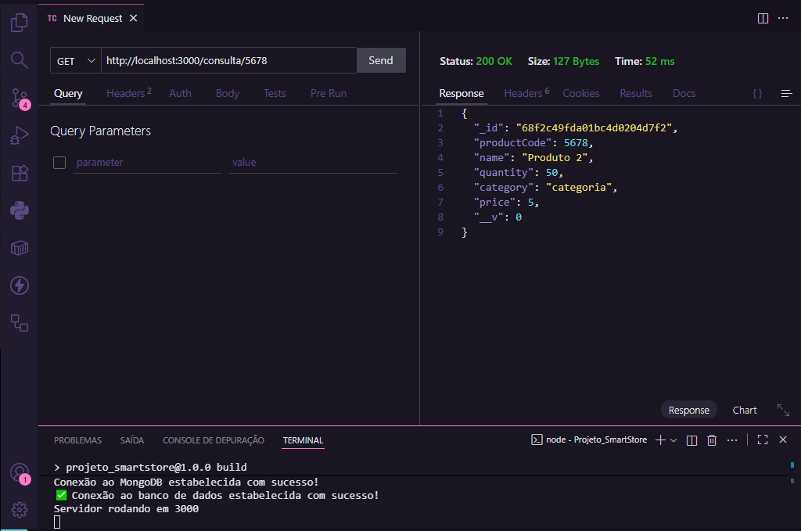
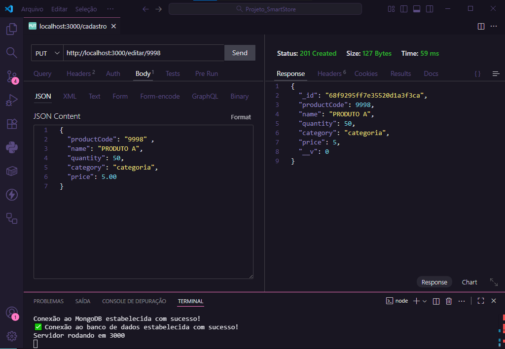
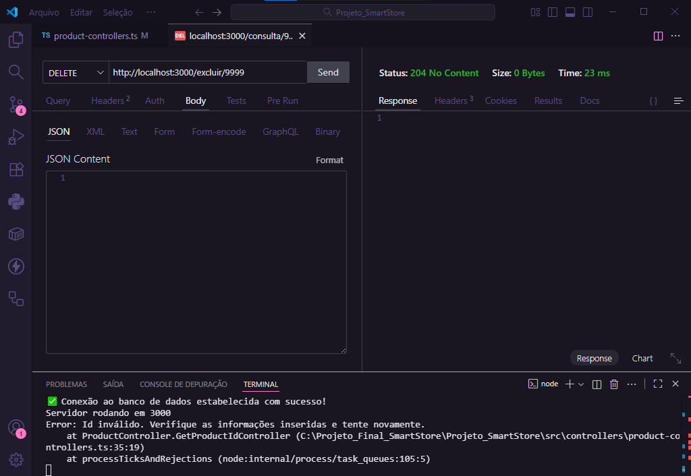

# Projeto SmartStore 

Essa é uma API simples e eficiente para gerenciar o estoque de uma loja. O projeto foi desenvolvido com TypeScript, Express, e tem integração com MongoDB, além de testes unitários e de integração. Foi estruturado utilizando os princípios da Clean Architecture para garantir organização e escalabilidade do código, além de seguir boas práticas de programação. Foi desenvolvido como projeto final da trilha de formação em back-end Aprofunda PretaLab.

## 📌 Objetivo
Permitir operações CRUD (Create, Read, Update, Delete) em registros de produtos, com segurança, permanencia em banco de dados e facilidade de testes e manutenção.

## 🛠️ Tecnologias Utilizadas
- TypeScript
- Express.js
- MongoDB – Banco de dados utilizado na aplicação
- Mongoose – Biblioteca para integração com o banco de dados
- Postman/Thunder Client – Testes rápidos das rotas da api
- Jest – Testes unitários
- SuperTest - Simula requisições HTTP para os testes
- GitHub Actions – Integração e entrega contínua (CI/CD)
- Render/Vercel – Plataforma de deploy da aplicação

## 🚀 Deploy
A aplicação está hospedada na plataforma Render, permitindo acesso público e escalabilidade automática.

## ⚙️ Pré-requisitos
Antes de iniciar o projeto, garanta que você tenha:
- Node.js (versão 16 ou superior)
- npm (instalado com o Node.js)
- Postman/ThunderClient para testar os endpoints
- MongoDB local ou instância na nuvem (ex: MongoDB Atlas)

## 📫 Endpoints Principais
```console
    | Método | Endpoint | Descrição | 
    | GET | / | Tela inicial
    | POST | /cadastro | Registra um novo produto
    | GET | /consulta | Consulta todos os produtos registrados
    | GET | /consulta/:productCode | Consulta um único produto registrado
    | PUT | /editar/:productCode | Edita informações de um produto registrado
    | DELETE | /excluir/:productCode | Exclui um produto dos registros
  
```

## 📁 Estrutura de Pastas (Clean Architecture)
```markdown
src/
│ │               
│ ├── controllers/ 
│ │     └── product-controllers
│ ├── database/
│ │     ├── MongooseConnection.ts       
│ │     └── ProductModel.ts
│ ├── repository/
│ │     └── product-repository
│ ├── routes/  
│ │     └── product-routes
│ ├─ services/         
│ │     └── product-services
│ ├── tests/
│ │     ├── unit/
│ │     └── integration/
│ ├── .github/                    
│ │     └── workflows/
│ └── server.ts
│
├── render.yaml
├── .gitignore
├── package.json
├── package-lock.json
└── tsconfig.json    

```

## 🚀 Instalação e Execução
### Clone o repositório
```console
git clone https://github.com/kim-a9/Projeto_SmartStore.git

```
###  Acesse a pasta do projeto
```console
cd pasta-projeto

```
###  Instale as dependências
```console
npm install

```
```console
npm run build

```
###  Inicie o servidor
```console
npm start

```

# 🧪 Testando a API
1. Mensagem inicial (GET http://localhost:3000/ )
EXEMPLO DE RESPOSTA (Thunder Client):


2. Adicionar um novo produto (POST http://localhost:3000/cadastro )
EXEMPLO DO BODY ENVIADO (Thunder Client):
```console
{
  "productCode": "1234" ,
  "name": "Produto modelo",
  "quantity": 50,
  "category": "categoria",
  "price": 5.00
}
```
EXEMPLO DE RESPOSTA (Thunder Client):


3. Pesquisar por todos os produtos ( GET http://localhost:3000/consulta )



4. Pesquisar por UM produto pelo código ( GET http://localhost:3000/consulta/:productCode )
EXEMPLO DE USO (Thunder Client): 
```console
GET http://localhost:3000/consulta/5678
```
EXEMPLO DE RESPOSTA (Thunder Client):



5. Editar informações de um produto ( PUT http://localhost:3000/editar/:productCode)
EXEMPLO DO BODY ENVIADO (Thunder Client):
```console
{
  "productCode": "9998" ,
  "name": "PRODUTO A",
  "quantity": 50,
  "category": "categoria",
  "price": 5.00
}
```
EXEMPLO DE RESPOSTA (Thunder Client):



6. Excluir um produto dos registros ( DELETE http://localhost:3000/excluir/:productCode)
EXEMPLO DE USO (Thunder Client): 
```console
GET http://localhost:3000/deletar/9999
```

EXEMPLO DE RESPOSTA (Thunder Client):




 